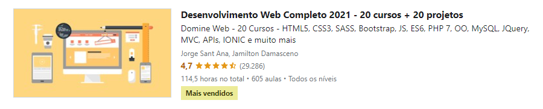

PROGRAMAÇÂO DE ESTUDO

- [x] O que irei aprender? html 5

- [x] Estrutura de uma página web - parte 1

- [x] Estrutura de uma página web - parte 2

- [x] Cabeçalhos

- [x] Parágrafos

- [x] Formatações de textos

- [] Listas ordenadas e não ordenadas

- [] Testando seus conhecimentos

- [] Imagens

- [] Links

- [] Tabelas

- [] Mais sobre tabelas

- [] Formulários

- [] Mais componentes de formulários

- [] Caracteres especiais

- [] Página inicial do #projeto1 UNES

- [] Finalizando #projeto1 UNES

- [] Conceitos de acessibilidade

 

<h3>Descrição e detalhes do curso</h3>

 

    
    <h4 align=center>Curso de Desenvolvimento Web Completo 2021 - 20 cursos + 20 projetos (<a href="https://www.udemy.com/share/101WqG3@Jx8ltkszlbFN0xkIPD8yWK3EggZ6fZKPI6cGhDY61f5HsCdDB2LI6rRyIo64Iysf/">Saiba mais! 🚀💻</a>)</h4> 
    
O curso conta com mais de 570 aulas, ao todo são mais de 110 horas de videoaulas em que são abordadas as principais tecnologias web do momento.

    
Este super pacote reúne incríveis 20 cursos. Para aprender tudo o que é proposto em mais de 110 horas de treinamento o aluno irá desenvolver 20 projetos reais.

    <h4>O que você aprenderá</h4> 
    
Criar aplicações WEB: Do front ao back-end e banco de dados com HTML5, CSS3, BootStrap 4, JS, ES6, ES7, PHP 7, OO, MySQL, JQuery, MVC, API, IONIC e Wordpress.Integrar as principais tecnologias Web através de projetos reais. Tudo na prática! Como tornar suas habilidades em desenvolvimento web uma atividade remunerada, trabalhando de onde quiser. Criar aplicações Mobile conectadas a aplicações WEB utilizando a tecnologia IONIC. HTML5: cabeçalhos, listas, imagens, links, tabelas, formulários, hear, nav, footer, article, section aside. CSS3 Intermediário: seletores, div & span, cores, modelo caixa, elementos flutuantes, posicionamento, formatando links. CSS3 avançado: herança, especifidade, barra navegação vertical e horizontal, abas, layouts líquidos, largura fixa, parallax, fontes customizadas. Recursos especiais: normalize css, cantos arredondados, degradês, sombras, animações, transições, flexbox.
Bootstrap: responsivo, textos, alinhamentos, cores, media query, botões, barra navegação, listas, inputs, alertas, tabelas, cards, grids, flexbox. Javascript: variáveis, array, condicionais, operadores de comparação, operadores lógicos, funções, eventos, DOM, loops, BOM. ES6: var e let, orientação a objetos, literais, prototype, web storage, funções de array. PHP7: variáveis, arrays, condicionais, operadores de comparação e lógicos, funções, orientação a objetos, abstração, herança, polimorfismo, interfaces. Banco de Dados MySQL: insert, update, select, delete, filtros, operadores de comparação e lógicos, relacionamentos, inner join, left join, right join. Ajax: requisições síncronas, requisições assíncronas, XMLHttpRequest, estados da requisição, status, notação XML, notação JSON.
PHP com PDO e MySQL: conexão com banco, executando instruções SQL, fetch, fetch all, foreach, SQL injection. Publicação de aplicações Web na Internet: DNS, hospedagem, cPainel, FTP, configuração do PHP e MySQL. jQuery: selecionando e manipulando elementos HTML, navegando entre elementos, manipulando CSS, eventos de teclado, mouse e formulário, animações, ajax. MVC com PHP: composer, controlador, rota, modelo, visão, abstração, reutilizando layout, conexão com banco de dados.
Projeto Twitter clone: registro e autenticação de usuários, criando timeline, pesquisando usuários, exibindo tweets, seguindo e deixando de seguir, paginação.
API com framework Slim: requisições, rotas, dependências, middleware, respostas, banco de dados, criando API. SAAS: alinhamento, variáveis, interpolação, for, while, each, funções, mixin, herança, diretivas de controle. IONIC: componentes, botões, entrada de dados, data biding, angular, grids, navegação e modelo.
WordPress: instalação, temas, personalização, plugins, usuários, comentários, criador de páginas com elementor.

